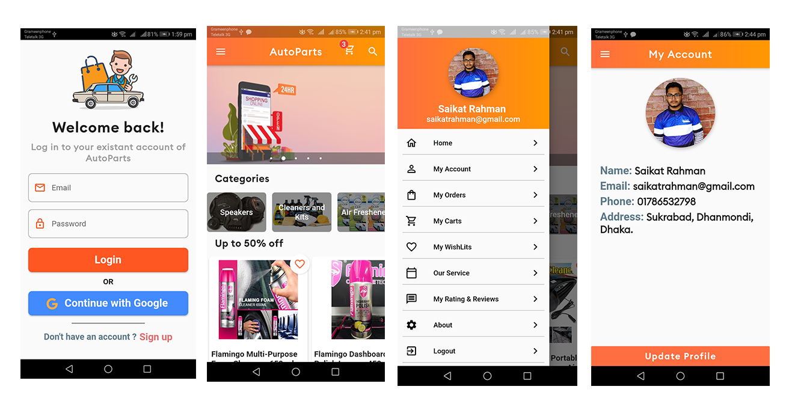

# AutoParts BD

## Project Description

Autoparts BD is a mobile application for all vehicle users. It is an online eCommerce and service provider application designed for all vehicle users. Using it, users will be able to easily buy the products they need. Without wasting time at a very low cost, users will be able to purchase car parts purchase through this app. Through this application, users will get many more services like a car wash, car maintenance, car repair which will make their daily life enjoyable and hassle-free.

This application has two parts, one for users and the other for admin. Users will be able to easily purchase products and receive services like car repair, car wash.
On the other hand, the admin can easily control the whole system. Admin can do everything from product addition to product price control, product delivery control. Admin also adds service and controls the service delivery process. Admin can add a beautiful carousel slider that actually helps to promote business. That actually increases the user attraction for buying products. It's really helpful for increasing sells ratio. Admin can see the total number of users, the total number of products, the total number of services, the total number of categories, brand, and the total number of orders. Admin can also see the total revenue from order and service.

Users will be able to easily open an account via their email and receive all exciting services. It is hoped that using this application will save them valuable time and money. By using this application consumers and sellers are going to be benefited.
The project is developed by Dart programming language through the Flutter framework. The easy interface and functionality help users and admin to manage the applying simply.

## Objective

The objective of the project Daily online searching is to switch searching system that helps the client to order product and conjointly the sellers to manage the sell simply and paying the bill exploitation online devices like pc, Smartphone, Tablet, etc. Though some days ago, People are worried the shopping goes to market physically and buy the specified products or service by the exchange of money during a selected time. But nowadays, The act of shopping for products or services over the web. Online searching has grown up in quality over the years, mainly because people find it convenient and simple to bargain shop from the comfort of their home or office. one among the chief alluring components about internet shopping, especially during a get-away season, is it reduces the need to go to in long queues or search from store to store for a particular item. Also, the seller may not head to the precise location in an exceedingly particular period to sell their products. In online shopping sellers get their freedoms to sell their products 24/7 during a very week from anywhere.
There are several objectives of the project. they're as follows:
• To provide a user-friendly interface to seem at different products which the consumer wants to shop for.
• Reduce management costs.
• Providing a unique customer experience.
• The number of loyal customers is increasing.
• To provide all exciting service features such as car wash, car maintenance, car repair, car denting and painting, car tire replacement, car windshield replacement, etc.
• To give a chance to open an account if any products are chosen by a customer online.
• To give a chance to pay product price online without being physically present in a specific place.
• To make the shopping system hassle-free and time-saving.

## AdminSide

## Project Output

;

